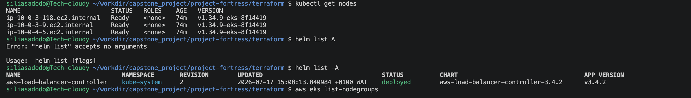
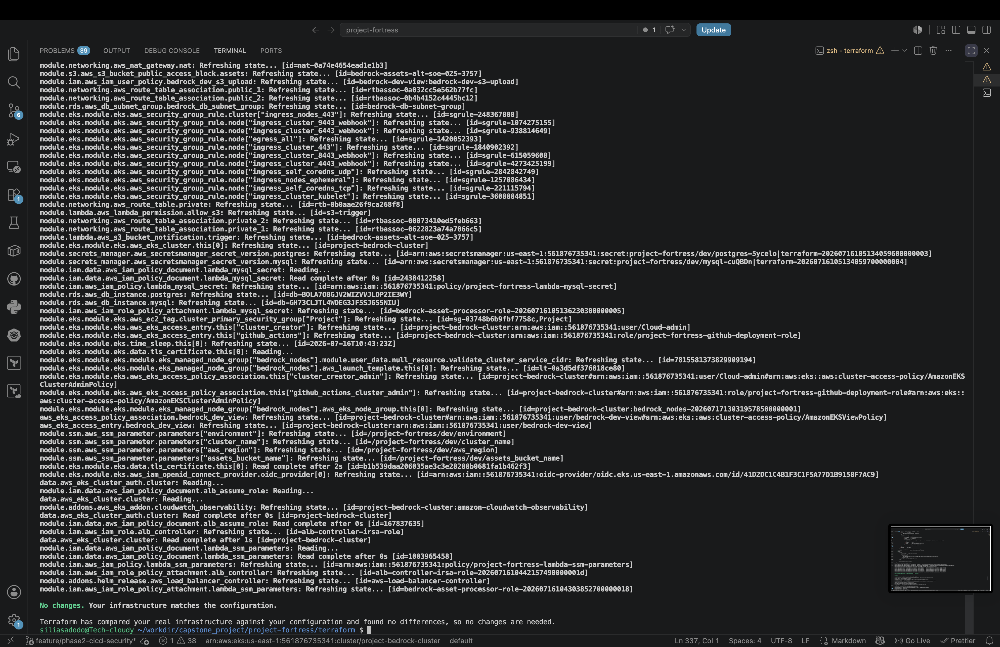

# Infrastructure Drift Recovery Incident Report

**Incident ID:** PF-IR-001

**Date:** 2026-07-17

**Project:** Project Fortress – Phase 2 (CI/CD & Security)

**Environment:** AWS Production (Project Bedrock)

**Severity:** Medium

**Status:** Resolved

---

# Executive Summary

A Terraform deployment pipeline failed due to infrastructure drift between the Terraform state file, AWS resources, and Kubernetes resources.

The drift was introduced after manual modifications were made to the Amazon EKS infrastructure outside Terraform. Specifically, an Amazon EKS managed node group was manually deleted, while other resources remained deployed but were no longer tracked correctly by Terraform.

The incident was resolved by restoring the missing infrastructure, importing unmanaged resources into the Terraform state, and reconciling the desired state with the actual infrastructure.

---

# Infrastructure Overview

**Cloud Provider**

- AWS

**Infrastructure as Code**

- Terraform

**Container Platform**

- Amazon EKS

**State Backend**

- Amazon S3 Remote Backend

**CI/CD**

- GitHub Actions
- GitHub OIDC Authentication

---

# Incident Timeline

| Time | Event |
|-------|------|
| T0 | GitHub Actions Terraform Apply failed |
| T+10 min | Verified Terraform configuration |
| T+20 min | Investigated Kubernetes authentication |
| T+35 min | Verified EKS Access Entries |
| T+45 min | Identified manually deleted node group |
| T+60 min | Recreated managed node group using Terraform |
| T+80 min | Imported CloudWatch Observability Add-on |
| T+95 min | Imported AWS Load Balancer Controller Helm Release |
| T+110 min | Terraform Plan returned "No changes" |
| T+115 min | Incident resolved |

---

# Symptoms

The following errors were observed during investigation.

## GitHub Actions

```
You must be logged in to the server
```

---

## Terraform

```
Kubernetes cluster unreachable
```

---

## Helm Provider

```
invalid configuration:
no configuration has been provided
```

---

## Terraform Plan

Terraform continuously attempted to recreate resources that already existed.

---

# Root Cause

The incident was caused by infrastructure drift.

Infrastructure drift occurred because infrastructure resources were manually modified outside Terraform.

The following drift occurred:

## Drift 1

The EKS managed node group was manually deleted from AWS.

Terraform state still believed the node group existed.

Result:

Terraform State ≠ AWS Infrastructure

---

## Drift 2

CloudWatch Observability Add-on already existed in AWS.

Terraform no longer managed the resource.

Result:

Terraform State ≠ AWS Resource

---

## Drift 3

AWS Load Balancer Controller existed inside Kubernetes.

Terraform state no longer tracked the Helm release.

Result:

Terraform State ≠ Kubernetes Cluster

---

# Investigation Process

The following verification commands were executed.

## Verify AWS Identity

```bash
aws sts get-caller-identity
```

---

## Verify Cluster

```bash
aws eks describe-cluster \
--name project-bedrock-cluster \
--region us-east-1
```

---

## Verify kubeconfig

```bash
aws eks update-kubeconfig \
--name project-bedrock-cluster \
--region us-east-1
```

---

## Verify Kubernetes

```bash
kubectl get nodes
```

---

## Verify Node Groups

```bash
aws eks list-nodegroups \
--cluster-name project-bedrock-cluster
```

---

## Verify Terraform State

```bash
terraform state list
```

---

## Verify Helm Releases

```bash
helm list -A
```

---

## Verify EKS Add-ons

```bash
aws eks list-addons \
--cluster-name project-bedrock-cluster
```

---

# Resolution

The following corrective actions were performed.

## 1. Recreated Missing Managed Node Group

Terraform recreated the deleted managed node group.

---

## 2. Imported CloudWatch Observability Add-on

```bash
terraform import \
module.addons.aws_eks_addon.cloudwatch_observability \
project-bedrock-cluster:amazon-cloudwatch-observability
```

---

## 3. Imported AWS Load Balancer Controller

```bash
terraform import \
module.addons.helm_release.aws_load_balancer_controller \
kube-system/aws-load-balancer-controller
```

---

## 4. Applied Infrastructure

```bash
terraform apply
```

---

## 5. Verified Desired State

```bash
terraform plan
```

Result

```
No changes.

Your infrastructure matches the configuration.
```

---

# Validation

The following validation checks were completed.

- Terraform Validate
- Terraform Plan
- Terraform Apply
- kubectl get nodes
- helm list -A
- aws eks list-addons
- GitHub Actions OIDC Authentication
- Remote State Validation

All validation checks completed successfully.

---

# Lessons Learned

This incident reinforced several important DevOps practices.

- Never manually modify Terraform-managed infrastructure.
- Infrastructure should be changed exclusively through Infrastructure as Code.
- Terraform state must always represent actual infrastructure.
- Existing cloud resources should be imported instead of recreated.
- Drift detection should be performed before production deployments.
- Every production incident should conclude with a documented postmortem.

---

# Preventive Actions

The following improvements have been identified.

- Enable routine Terraform drift detection in CI.
- Restrict manual AWS console changes through IAM.
- Periodically compare Terraform state with deployed infrastructure.
- Document operational recovery procedures.
- Continue using GitHub OIDC instead of long-lived AWS credentials.

---

# Incident Outcome

Status: Resolved

Final Terraform State

```
No changes.

Your infrastructure matches the configuration.
```

The Terraform configuration, Terraform state, AWS infrastructure, and Kubernetes resources are fully synchronized.

---

# Evidence


[terraform plan](evidence/screenshots/terraform-apply.png)
 
